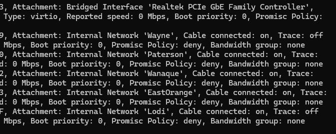

# Module 01 — Network Foundation

## Goal
Stand up pfSense as the virtual router and firewall, create all 5 site network
segments in VirtualBox, and verify inter-site routing before any Windows Server
VM is built.

## Status
🔄 In Progress

## pfSense VM Specs
| Setting | Value |
|---------|-------|
| VM Name | pfSense-Router |
| RAM | 1024 MB |
| CPUs | 1 |
| Disk | 16 GB (dynamic) |
| Adapter 1 | Bridged — WAN (internet uplink) |
| Adapter 2 | Internal Network — Wayne_HQ |
| Adapter 3 | Internal Network — Paterson |
| Adapter 4 | Internal Network — Wanaque |
| Adapter 5 | Internal Network — EastOrange (via VBoxManage) |
| Adapter 6 | Internal Network — Lodi (via VBoxManage) |

## Interface IP Assignments (pfSense)
| Interface | Role | IP |
|-----------|------|----|
| WAN (vtnet0) | Internet uplink | DHCP from home router |
| LAN (vtnet1) | Wayne HQ | 10.10.0.1/24 |
| OPT1 (vtnet2) | Paterson | 10.10.1.1/24 |
| OPT2 (vtnet3) | Wanaque | 10.10.2.1/24 |
| OPT3 (vtnet4) | East Orange | 10.10.3.1/24 |
| OPT4 (vtnet5) | Lodi | 10.10.4.1/24 |

## Design Decisions
- DHCP handled by pfSense per site — not the Domain Controller.
  Rationale: minimize DC attack surface. A DHCP compromise must not give
  access to Active Directory.
- Each site on its own VirtualBox Internal Network — isolated broadcast
  domain, no direct access to host machine or home network.
- Only pfSense WAN adapter is Bridged — single controlled point touching
  the real network.
- Adapters 5 and 6 added via VBoxManage CLI — VirtualBox GUI only exposes
  4 adapters, CLI required for additional NICs.

## Steps Completed

### Step 2 — pfSense Installation

## Issues Encountered
<!-- Any problems hit and how they were resolved -->

## Verification
<!-- Commands run and output confirming the module works -->
