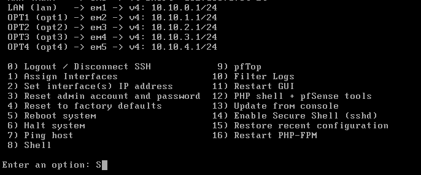

# Module 01 — Network Foundation

## Goal
Stand up pfSense as the virtual router and firewall, create all 5 site network
segments in VMware Workstation Pro, and verify inter-site routing before any Windows Server
VM is built.

## Status
🔄 In Progress

## pfSense VM Specs
| Setting | Value |
|---------|-------|
| VM Name | pfSense-Router |
| RAM | 1024 MB |
| CPUs | 1 |
| Disk | 16 GB (dynamic) |
| Adapter 1 | Bridged — WAN (internet uplink) |
| Adapter 2 | LAN Segment — Wayne_HQ |
| Adapter 3 | LAN Segment — Paterson |
| Adapter 4 | LAN Segment — Wanaque |
| Adapter 5 | LAN Segment — EastOrange (via VMware Workstation CLI / vmrun) |
| Adapter 6 | LAN Segment — Lodi (via VMware Workstation CLI / vmrun) |

## Interface IP Assignments (pfSense)
| Interface | Role | IP |
|-----------|------|----|
| WAN (vtnet0) | Internet uplink | DHCP from home router |
| LAN (vtnet1) | Wayne HQ | 10.10.0.1/24 |
| OPT1 (vtnet2) | Paterson | 10.10.1.1/24 |
| OPT2 (vtnet3) | Wanaque | 10.10.2.1/24 |
| OPT3 (vtnet4) | East Orange | 10.10.3.1/24 |
| OPT4 (vtnet5) | Lodi | 10.10.4.1/24 |

## Design Note: VLANs vs. Site Subnetting

This lab uses separate Layer 3 subnets (one /24 per site) rather than
VLANs to achieve network segmentation. This is a deliberate design
choice based on what each technology actually solves:

**Site-to-site separation (this lab)** — Wayne HQ, Paterson, Wanaque,
East Orange, and Lodi represent five distinct physical locations.
Separate physical sites are segmented using Layer 3 (separate subnets
routed by a firewall/router — pfSense, in this case), typically
connected over WAN links, VPN tunnels, or MPLS circuits in a real
deployment. VLANs don't apply at this layer since VLANs operate within
a shared physical switching infrastructure — you can't VLAN across
buildings without a WAN link carrying that traffic anyway.

**Department-level separation (not implemented in this lab, noted for
context)** — Within a single physical site, departments (e.g., Sales,
Engineering, Servers) are typically segmented using VLANs at Layer 2.
Each VLAN is mapped to its own subnet, and a Layer 3 device (firewall,
router, or core switch) routes between them using either dedicated
interfaces or a trunk port with 802.1Q tagging.

**How this scales in a real enterprise:** A 1000-person company with
five sites would not deploy five independent /16 networks — that would
waste enormous address space (5 x 65,534 addresses for what might be
20-200 devices per site). Instead, the organization would typically
receive one larger private allocation (e.g., 10.0.0.0/8), subnet that
block per site using the 2nd or 3rd octet as a site identifier, and
then further slice each site's allocation into VLANs per department.

**Summary:** Site separation = Layer 3 (subnets/routing). Department
separation within a site = Layer 2 (VLANs), each still mapped to its
own Layer 3 subnet. This lab implements only the site-separation layer;
VLANs are a natural extension point for anyone building on this
architecture.

## Design Decisions
- DHCP handled by pfSense per site — not the Domain Controller.
  Rationale: minimize DC attack surface. A DHCP compromise must not give
  access to Active Directory.
- Each site on its own VMware Workstation Pro LAN Segment — isolated broadcast
  domain, no direct access to host machine or home network.
- Only pfSense WAN adapter is Bridged — single controlled point touching
  the real network.
- Adapters 5 and 6 configured via VMware Workstation CLI / vmrun — additional
  NICs added outside the standard GUI workflow.

## Steps Completed

### Step 2 — pfSense Installation

<!-- Screenshots will be added here -->

*All 5 site interfaces fully assigned: LAN (Wayne HQ, 10.10.0.1/24), OPT1 (Paterson, 10.10.1.1/24), OPT2 (Wanaque, 10.10.2.1/24), OPT3 (East Orange, 10.10.3.1/24), OPT4 (Lodi, 10.10.4.1/24). Each interface owns the .1 gateway address on its respective /24 subnet, with DHCP enabled and scoped to .100-.200 per site.*

## Issues Encountered
<!-- Any problems hit and how they were resolved -->

## Verification
<!-- Commands run and output confirming the module works -->
